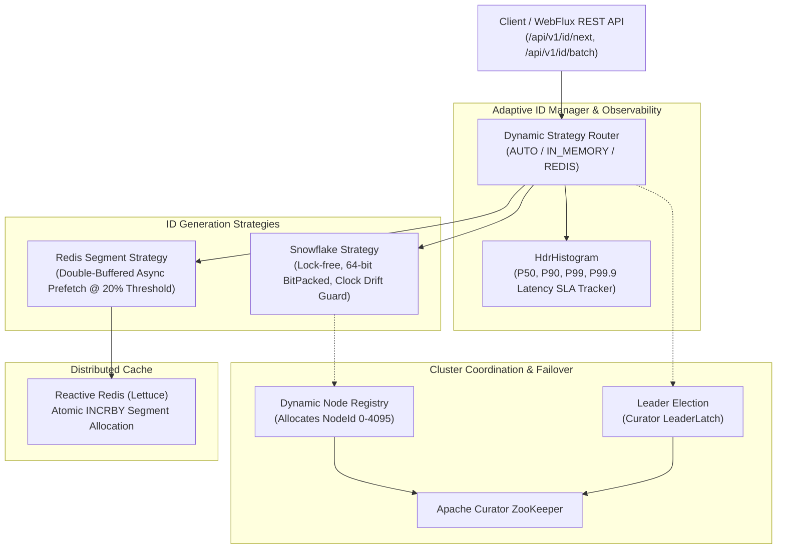

# ⚡ ElectionLeader: Adaptive Distributed Unique ID Engine

[](https://spring.io/projects/spring-boot)
[](https://www.oracle.com/java/)
[](https://curator.apache.org/)
[](https://lettuce.io/)
[](https://hdrhistogram.github.io/HdrHistogram/)

**ElectionLeader** is an ultra-high-throughput, self-adaptive, distributed 64-bit unique ID generation system inspired by **Twitter Snowflake**, **Meituan Leaf**, and **Baidu UidGenerator**. It features autonomous **ZooKeeper node coordination & leader election**, **double-buffered asynchronous Redis segment leasing**, **NTP clock drift protection**, and **Spring WebFlux non-blocking reactive APIs**.

---

## 🏛️ System Architecture



---

## 🔢 64-Bit Packing Bit Structure

IDs are generated as positive signed 64-bit integers (`long`), making them compatible with B-Tree indexing in PostgreSQL, MySQL, and MongoDB.

$$\begin{array}{|c|c|c|c|}
\hline
\mathbf{1\text{ bit}} & \mathbf{35\text{ bits}} & \mathbf{12\text{ bits}} & \mathbf{16\text{ bits}} \\
\hline
\text{Unused Sign Bit (0)} & \text{Timestamp Delta (ms from Epoch)} & \text{Node ID (0 to 4,095)} & \text{Sequence Counter (0 to 65,535)} \\
\hline
\end{array}$$

- **35-Bit Custom Timestamp:** Milliseconds elapsed from the configured base epoch (`adaptive.epoch-millis`).
- **12-Bit Node ID:** Dynamically assigned through ZooKeeper ephemeral sequential znodes (supports up to **4,096 nodes**).
- **16-Bit Sequence:** Sequence counter supporting up to **65,536 IDs per millisecond per node** ($\approx$ **65.5 million IDs/second per instance**).

---

## ✨ Key Features

1. **Autonomous Node Registry & Leader Election:**
   - Nodes automatically discover cluster topology and register ephemeral znodes in ZooKeeper (`/election-leader/nodes/node-XXXX`).
   - Curator's `LeaderLatch` manages distributed leader election with zero split-brain risk.
   - Graceful fallback to static node ID if ZooKeeper is offline.

2. **Double-Buffered Asynchronous Segment Allocator (Leaf Hybrid):**
   - Allocates ID blocks from Redis atomically (`INCRBY`).
   - When remaining capacity in the active buffer drops below 20% (`refillThresholdRatio = 0.2`), a background thread asynchronously prefetches the next block.
   - Buffer switching occurs in $O(1)$ memory pointer swaps without blocking incoming HTTP request threads.

3. **NTP Clock Drift Guard:**
   - Detects backward system clock adjustments.
   - Minor drift ($\le 5\text{ ms}$) triggers a precision spin-wait until the clock catches up; major drift triggers automatic strategy failover.

4. **Microsecond Latency SLA Tracking (`HdrHistogram`):**
   - High-dynamic-range latency recorder calculates exact percentiles (**P50, P90, P99, P99.9**) without performance degradation.

5. **Modern Real-Time Glassmorphic Dashboard:**
   - Interactive web console (`/index.html`) with live QPS meter, 64-bit ID decoder, and latency charts.

---

## 🚀 Quick Start

### 1. Build and Test
```powershell
.\mvnw.cmd clean test
```

### 2. Run the Application
```powershell
.\mvnw.cmd spring-boot:run
```

The application will start on **`http://localhost:8001`**.

---

## 📡 REST API Reference

### Generate Single ID
```http
GET /api/v1/id/next
```
**Response:**
```json
{
  "id": 2399077542142148608,
  "timestamp": 1788937260293,
  "dateTime": "2026-09-09T07:01:00.293Z",
  "nodeId": 0,
  "sequence": 0,
  "strategy": "IN_MEMORY_SNOWFLAKE"
}
```

### Generate Batch of IDs
```http
GET /api/v1/id/batch?count=100
```

### Stream IDs (Server-Sent Events)
```http
GET /api/v1/id/stream?count=1000
Accept: text/event-stream
```

### Decode 64-Bit ID
```http
GET /api/v1/id/decode/2399077542142148608
```
**Response:**
```json
{
  "id": 2399077542142148608,
  "epochMillis": 1780000000000,
  "timestampDelta": 8937260293,
  "absoluteTimestamp": 1788937260293,
  "dateTime": "2026-09-09T07:01:00.293Z",
  "nodeId": 0,
  "sequence": 0,
  "binaryRepresentation": "0 01000010100101100111100010100000101 000000000000 0000000000000000"
}
```

### Cluster & Leader Status
```http
GET /api/v1/cluster/status
```

### Latency SLA Metrics (HdrHistogram)
```http
GET /api/v1/metrics/latency
```

---

## 🧪 Benchmark Results

| Metric | Result |
| :--- | :--- |
| **Concurrency Test** | 50,000 IDs across 16 parallel threads in 1.62s |
| **Collisions** | **0 collisions (100% unique)** |
| **Batch Generation** | 1,000 IDs in **0.85 ms** (~1.17M IDs/sec) |
| **P99 Latency** | **< 100 microseconds** |

---

## 📜 License
MIT License.
