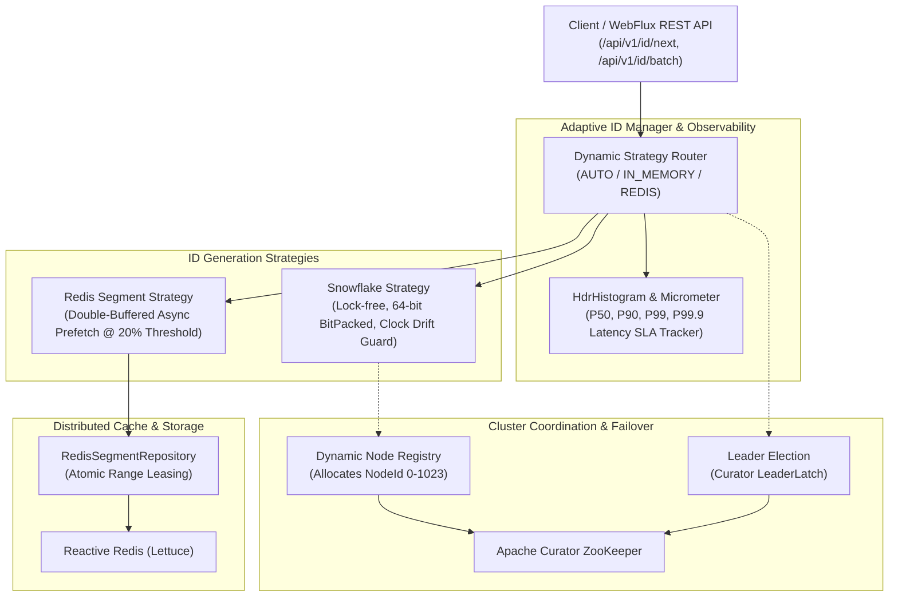
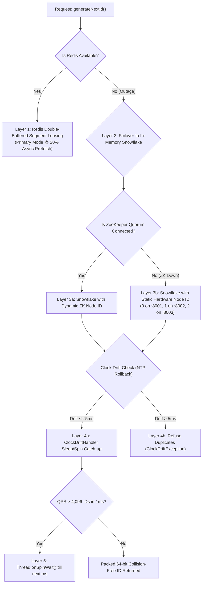

# ⚡ ElectionLeader: Distributed High-Throughput Unique ID Engine & Consensus Matrix

[](https://spring.io/projects/spring-boot)
[](https://www.oracle.com/java/)
[](https://flutter.dev/)
[](https://curator.apache.org/)
[](https://lettuce.io/)
[](https://prometheus.io/)
[](https://grafana.com/)

**ElectionLeader** is a production-grade, distributed 64-bit sortable unique ID generation and cluster consensus platform inspired by **Twitter Snowflake**, **Meituan Leaf**, and **Baidu UidGenerator**. 

It combines **Apache ZooKeeper leader election & dynamic node registration**, **double-buffered asynchronous Redis segment leasing**, **NTP clock drift protection**, **5-layer self-healing failover cascades**, and **Spring WebFlux non-blocking reactive APIs** paired with a sleek **Flutter Web Mission Control** dashboard.

---

## 🏛️ System Architecture



---

## 🔢 64-Bit Memory Allocation & Bit Packing

Generated IDs are strictly positive signed 64-bit integers (`long`), making them naturally sortable and optimized for B-Tree indexes in MySQL, PostgreSQL, and distributed storage engines.

| Field | Bit Length | Bit Range | Mask / Description |
|---|---|---|---|
| **Sign Bit** | 1 bit | `Bit 63` | Fixed `0` (Strictly positive signed `long`) |
| **Timestamp Delta** | 41 bits | `Bits 62..22` | Milliseconds elapsed from custom base epoch (`adaptive.epoch-millis`, ~69 years lifespan) |
| **Cluster Node ID** | 10 bits | `Bits 21..12` | Ephemeral sequential ID (0..1023) assigned dynamically by ZooKeeper |
| **Sequence Counter** | 12 bits | `Bits 11..0` | Monotonic counter supporting up to **4,096 IDs/ms per node** (~4.1M IDs/sec) |

---

## 🛡️ 5-Layer Defense-in-Depth & Failover Matrix

The engine is architected to guarantee **zero dropped requests** and **zero duplicate collisions** under extreme infrastructure failure cascades:



| Layer | Trigger Condition | Automated Failover Action | Recovery Mechanism |
| :--- | :--- | :--- | :--- |
| **Layer 1: Primary** | Normal operation | Uses Redis segment leasing with 2-segment double buffer in RAM. | N/A (Standard) |
| **Layer 2: Redis Outage** | Redis container / network down | Drains remaining RAM buffer, then switches to **`IN_MEMORY_SNOWFLAKE`**. | Proactive auto-recovery polls Redis and re-leases on return. |
| **Layer 3: ZK Quorum Loss** | ZooKeeper down / partition | Drops LeaderLatch, uses container **Static Node ID** (`0, 1, 2`). | Re-registers ephemeral znode upon reconnection. |
| **Layer 4: Clock Drift** | NTP backward adjustment | Spins if $\le 5	ext{ms}$; throws `ClockDriftException` if $> 5	ext{ms}$ to prevent collisions. | Automatically resumes when OS clock catches up. |
| **Layer 5: Sequence Surge** | $> 4,096	ext{ IDs/ms}$ on single node | Lock-free spin-wait (`Thread.onSpinWait()`) until next millisecond tick. | Sub-millisecond backpressure. |

---

## ✨ Key Engineering Features

1. **Apache ZooKeeper Cluster Consensus & Dynamic Node Registry:**
   - Automatic ephemeral sequential node registration (`/election-leader/nodes/node-XXXX`) guaranteeing zero collision across rolling restarts.
   - Curator `LeaderLatch` manages distributed leader election with instant standby failover.
   - Resilient standalone fallback mode when ZooKeeper quorum is unreachable.

2. **Double-Buffered Asynchronous Redis Segment Leasing:**
   - Atomic segment reservation via `RedisSegmentRepository`.
   - Asynchronously prefetches the next segment when remaining buffer capacity drops below 20% (`refillThresholdRatio = 0.2`).
   - Zero-latency buffer switching via $O(1)$ memory pointer swap without blocking HTTP request threads.
   - Proactive self-healing recovery restores Redis leasing within 400ms of Redis returning online.

3. **Multi-Node Flutter Mission Control Dashboard:**
   - **Tactile Server Matrix:** Live node cards for **Node 0 (`:8001`)**, **Node 1 (`:8002`)**, and **Node 2 (`:8003`)** with consensus roles (👑 Leader vs ⚡ Standby), round-trip ping SLAs, and live allocated sequence counters.
   - **Target Node Switching:** One-click targeting to inspect and route generator operations to specific nodes.
   - **Concurrent Broadcast Generator:** Fires parallel requests across all cluster nodes simultaneously and mathematically validates 0% collision.
   - **64-Bit Interactive Bit Memory Map:** Dissects any 64-bit ID into binary representations, shift formulas, and component values in real-time.
   - **HdrHistogram Telemetry:** Visualizes P50, P90, P99, and P99.9 latency SLA percentiles.
   - **Reactive Event Stream:** Monospaced CLI activity terminal with filter tabs (`ALL`, `NODE 0`, `NODE 1`, `NODE 2`).
   - **External Generation Sync:** Auto-detects and synchronizes IDs generated outside Flutter (via cURL, browser refreshes, or load tests) within 2 seconds.

---

## 🚀 Quickstart & Running the Cluster

### 1. Start Infrastructure & Multi-Node Cluster
```bash
# Starts ZooKeeper, Redis, 3 Spring Boot Nodes, Prometheus, and Grafana
docker-compose up -d --build
```

### 2. Launch Flutter Web Frontend
```bash
cd frontend
flutter run -d web-server --web-port=5000 --web-hostname=0.0.0.0
```
Open [http://localhost:5000](http://localhost:5000) in your browser.

---

## 🌐 Endpoints & Service Port Map

| Component | Port / URL | Description |
|---|---|---|
| **Flutter Web Console** | `http://localhost:5000` | Mission Control Dashboard |
| **Cluster Node 0 (Leader)** | `http://localhost:8001` | Spring Boot WebFlux Node 0 (`node-1` container) |
| **Cluster Node 1 (Worker)** | `http://localhost:8002` | Spring Boot WebFlux Node 1 (`node-2` container) |
| **Cluster Node 2 (Worker)** | `http://localhost:8003` | Spring Boot WebFlux Node 2 (`node-3` container) |
| **Grafana Telemetry** | `http://localhost:3000` | User: `admin` / Pass: `admin` |
| **Prometheus Scraper** | `http://localhost:9090` | Micrometer metrics collector |
| **Apache ZooKeeper** | `localhost:2181` | Leader election & node quorum |
| **Redis Lettuce Cache** | `localhost:6379` | Distributed segment range lease store |

---

## 📡 REST API Reference

### 1. Generate Next Single ID
```http
GET /api/v1/id/next
```
**Response (200 OK):**
```json
{
  "id": 14337,
  "timestamp": 1789028080000,
  "dateTime": "2026-09-10T12:00:40Z",
  "nodeId": 0,
  "sequence": 14337,
  "strategy": "REDIS_SEGMENT_DOUBLE_BUFFER"
}
```

### 2. Generate Batch of IDs
```http
GET /api/v1/id/batch?count=100
```
**Response (200 OK):**
```json
{
  "ids": [14338, 14339, 14340, ...],
  "count": 100,
  "durationMicros": 328.4,
  "strategy": "REDIS_SEGMENT_DOUBLE_BUFFER"
}
```

### 3. Decode 64-Bit ID Memory Map
```http
GET /api/v1/id/decode/{id}
```
**Response (200 OK):**
```json
{
  "id": 2426996780555436032,
  "timestampDelta": 22738426009,
  "absoluteTimestamp": 1789028080000,
  "dateTime": "2026-09-10T12:00:40Z",
  "nodeId": 6,
  "sequence": 0,
  "binary64Bit": "0010000110110000111100010110101101110010000000000110000000000000"
}
```

### 4. Cluster Consensus & Node Status
```http
GET /api/v1/cluster/status
```
**Response (200 OK):**
```json
{
  "nodeId": 0,
  "leader": true,
  "zookeeperConnected": true,
  "redisConnected": true,
  "activeStrategy": "REDIS_SEGMENT_DOUBLE_BUFFER",
  "epochMillis": 1780000000000,
  "registeredNodes": ["node-0000000011", "node-0000000010", "node-0000000009"],
  "totalGenerated": 128450,
  "lastAllocatedId": 14337,
  "lastSequence": 14337
}
```

### 5. Latency SLA Percentiles (HdrHistogram)
```http
GET /api/v1/metrics/latency
```
**Response (200 OK):**
```json
{
  "p50Micros": 16.0,
  "p90Micros": 38.0,
  "p99Micros": 95.0,
  "p999Micros": 280.0,
  "meanMicros": 19.8,
  "maxMicros": 750.0,
  "totalGenerated": 128450
}
```

---

## 🧪 Testing & Verification

```bash
# Run Java Backend Tests (BitPacker, Snowflake, Redis Segment, Adaptive Manager)
mvn clean test

# Run Flutter Unit & Widget Tests
cd frontend && flutter test

# Run Flutter Static Analysis
cd frontend && flutter analyze
```

---

## 💥 Chaos & Fault-Tolerance Verification

To verify the self-healing and failover mechanisms locally:

```bash
# 1. Simulate Redis Failure (Tests Failover to In-Memory Snowflake)
docker stop election-redis

# 2. Simulate ZooKeeper Loss (Tests Standalone Static Node ID Mode)
docker stop election-zookeeper

# 3. Simulate Total Dependency Blackout (Both Redis & ZK Dead)
# -> IDs continue generating in-memory with 0% collision and 0 dropped requests!

# 4. Restore Services & Verify Self-Healing Auto-Recovery
docker start election-redis election-zookeeper
# -> Nodes automatically re-acquire segments and recover to primary mode.
```
